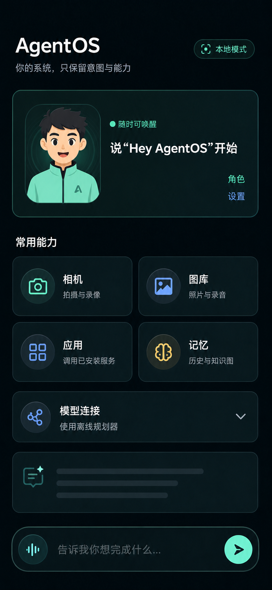
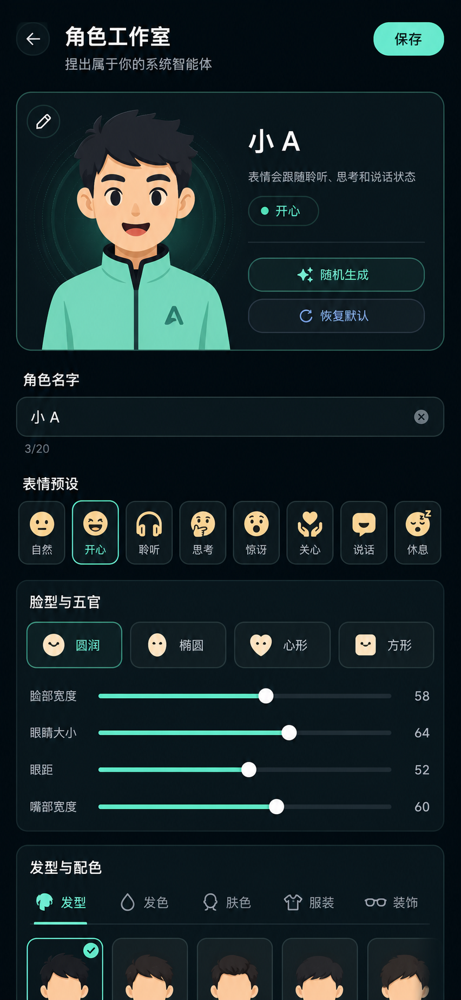
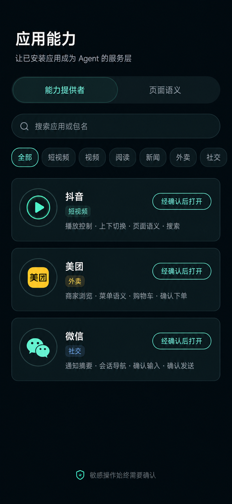
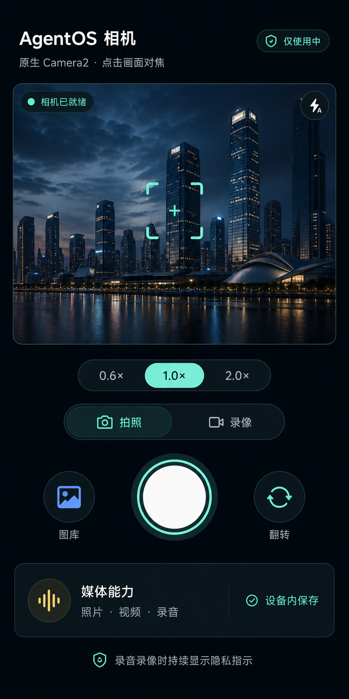
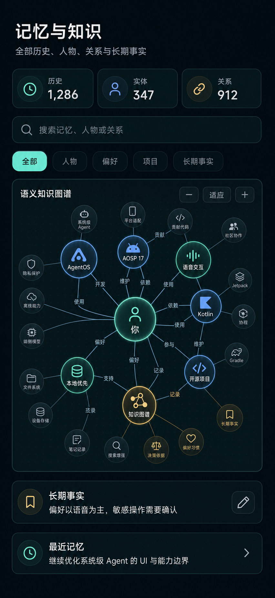

# AgentOS native UI system

The AgentShell interface is a native Kotlin Compose surface rather than a WebView.
It uses a dark spatial palette with mint for trusted local actions, blue for model
or information state, amber for confirmation, and red only for capture or danger.
Translucent bordered panels provide depth without continuous blur or animation.

The layout hierarchy is consistent across screens:

1. a title, plain-language subtitle, and compact system status;
2. one primary task surface rather than a long stack of unrelated settings;
3. contextual actions close to the content they affect;
4. destructive or external actions behind a clearly separated confirmation;
5. the command composer fixed above navigation and the software keyboard.

The home screen prioritizes the voice agent, then camera, gallery, installed apps,
and memory. Model configuration is collapsed by default. App Bridge adds search,
domain filters, declared capability chips, semantic-node actions, and a second
confirmation step for text input. Media and knowledge screens reuse the same top
bar, panels, status pills, spacing, colors, and shape language.

State remains in existing `StateFlow` ViewModels. Composables receive immutable
state snapshots and event callbacks; they do not bind services, perform storage,
or execute privileged actions during composition.

## Current visual baseline

These high-fidelity mockups are synchronized with the current Kotlin/Compose
structure and design tokens. They are product-design references, not emulator or
device screenshots. Runtime verification must still be performed on an AOSP build.

| Agent home | Character studio |
| --- | --- |
|  |  |

| App capability center | Native camera |
| --- | --- |
|  |  |

The source prompts, update contract, and verification scope are recorded in
[`images/ui-v2/README.md`](images/ui-v2/README.md).
