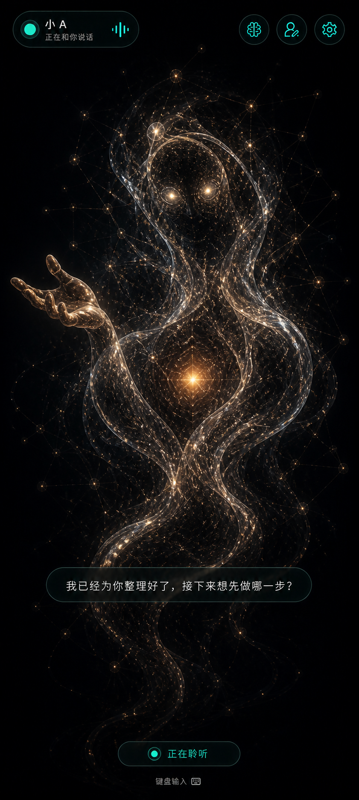
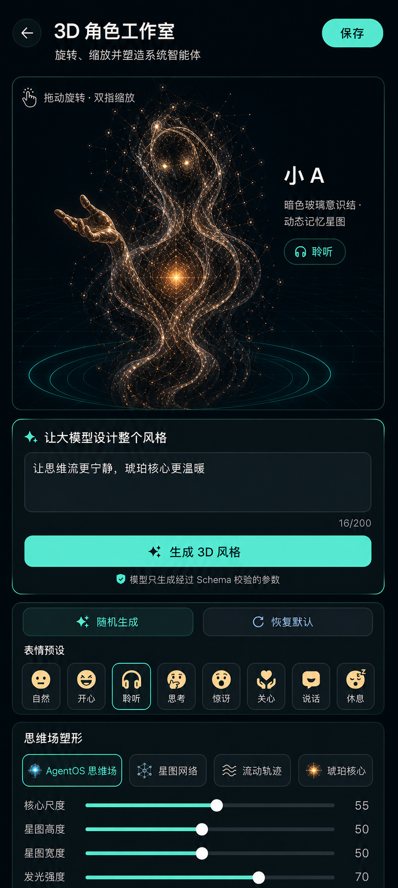
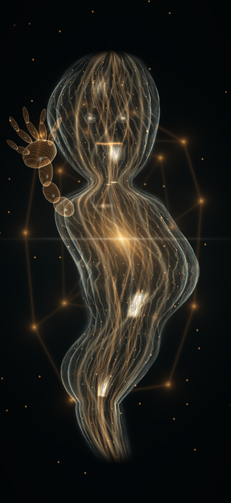

# AgentOS native UI and isolated character renderer

The AgentShell interface, navigation, permissions, subtitles, confirmation, and
voice controls remain native Kotlin Compose. Only the replaceable full-screen
`SYSTEM` character canvas runs in an offline WebView/WebGL sandbox. JavaScript
receives bounded visual state but cannot call Android services or render trusted
confirmation UI. The design uses a dark spatial palette with mint for trusted local
actions, blue for model or information state, amber for confirmation, and red only
for capture or danger. Translucent bordered panels provide depth without continuous
blur.

The home is intentionally different from task screens:

1. the full-screen 3D character is the primary system surface;
2. state, subtitles, and voice controls float briefly over the stage;
3. the keyboard is an accessibility fallback and stays collapsed;
4. configuration is hidden until explicitly requested;
5. destructive or external actions still interrupt with a clear confirmation.

Camera, gallery, installed apps, memory, and other capabilities are reached through
natural-language intent instead of a permanent app grid. App Bridge adds search,
domain filters, declared capability chips, semantic-node actions, and a second
confirmation step for text input. Media and knowledge screens reuse the same top
bar, panels, status pills, spacing, colors, and shape language.

State remains in existing `StateFlow` ViewModels. Composables receive immutable
state snapshots and event callbacks; they do not bind services, perform storage,
or execute privileged actions during composition.

## Selected 3D visual targets

**设计效果图，非当前代码运行截图。** These two maintainer-selected references define
the intended full-screen companion and Character Studio appearance. The current
renderer does not yet match their fidelity; depicted controls and effects are
design goals, not proof of implemented or validated behavior.

| Agent home · 首页 | Character Studio · 角色工作室 |
| --- | --- |
|  |  |

## Runtime-derived avatar capture

The following frame is rendered by AgentShell's bundled JavaScript runtime using the
production volume and glass shaders, indexed 3D surface, and joint rig. The checked-in
browser harness loads that exact runtime. It is not AI-generated and is never loaded
as a texture by the app. It records the implemented character material and effects,
separately from the visual targets above; real Android System WebView/GPU validation
is still required.

View the separate renderer-derived capture / 查看代码渲染记录

## Other Compose layout references

These mockups describe placement, typography, and interaction hierarchy only. Their
pixels are not implementation evidence. Earlier home and studio mockups remain in
the image directory as historical references.

| App capability center | Native camera |
| --- | --- |
|  |  |

The shader capture command, source prompts, update contract, and verification scope are recorded in
[`images/ui-v2/README.md`](images/ui-v2/README.md).
